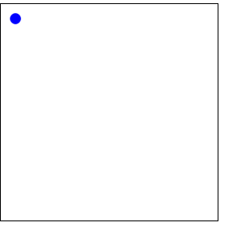

# php-projects
# Bouncing Ball

## Table of Contents
[Overview]
[Tools]
[Usage]
[Contact]

**Overview**:
- A personal basic php project as serverside logic. 
  It uses majorly Html, Css, javascript for the UI layout and applies php for use on the back end.

**Tools**:
- HTML5
- CSS,
- JavaScript ES6 languages
- php (serverside XAMPP)
- Various linteres for the correction of possible code errors

**usage**:
- To view and use the app, fork the 'index html' code from my github reppository and  open directly in your web browser.
